# Analyse

## Mindmap

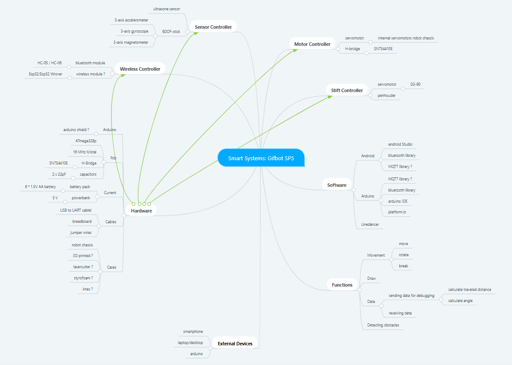

## Beschrijving
Dit is een project van Feng Lin, Kasper Ruys, Anjil Subedi en Cédric van Broek. We maken een robot die een GIF tekening kan genereren met de gegeven coördinaten.

Hiervoor hebben we van de onderwijsinstelling een kit gekregen met de nodige onderdelen. De ultrasone sensoren en de 9DOF stick zullen een grote rol spelen in ons project. Hierdoor zal het mogelijk zijn dat onze robot kan navigeren in zijn omgeving zonder tegen obstakels te rijden. Er zal een manier gezocht moeten worden om de code van Line Dancer aan te passen, om zo een file te creëren die de robot kan lezen om zijn tekening mee te maken.

Eerst en vooral gaan we een android applicatie maken, waarmee we de robot manueel kunnen besturen. Je kan verschillende dingen doen met de applicatie. Het belangrijkste is een bluetooth verbinding maken met de robot. Er is ook een mogelijkheid om een .TXT bestand te kunnen uploaden waar de coördinaten van de tekening worden doorgegeven (de coördinaten worden gegenereerd met LineDancer). De data zal worden verstuurd naar de robot. Zo zal de robot zijn coördinaten krijgen, om er een een GIF tekening mee te maken.
De applicatie heeft ook nog 2 andere belangrijke knoppen. Een startknop en een knop om te kalibreren. Door op de startknop te drukken, zal de robot kunnen beginnen met het tekenen. Door op de kalibratie knop te drukken, zal de robot al zijn sensoren gebruiken om de nodige data te krijgen over zijn positie. Dan worden de ultrasone sensoren en de 9DOF stick geactiveerd. Er worden twee ultrasone sensoren gebruikt voor de robot, één aan de linkerkant en één aan de voorkant van de robot. De ultrasone sensoren zullen de afstand bepalen tussen de robot en de muren van de houten kist, zo zal de robot weten waar hij zich bevindt. Bij de 9DOF stick zitten er 3 sensoren. Daarvan gaan we er twee gebruiken: de gyroscoop en de accelerometer. We gaan met de gyroscoop bepalen wat de hoekmeting zal zijn als de robot gaat draaien, hoe snel de robot zal kunnen bewegen en hoeveel graden hij zal moeten draaien. 

Om dit project af te werken, maken we gebruik van de agile scrum methode. We praten samen over wat er allemaal moet gebeuren en zetten deze taken om in user stories. Afhankelijk van hoe zwaar de taak is, geven we dan hogere of lagere user story points, die ongeveer zullen aantonen hoeveel tijd er moet worden ingestoken. Deze delen we dan op in sprints met ongeveer een 20-tal user story points totaal. Voor dit project hebben we 4 Epics. Robot is alles dat te maken heeft met de robot opbouwen tot een zo klein mogelijk rijdende robot. De microcontroller epic gaat over de C/C++ ontwikkeling van de embedded systemen. Dan is er de Android epic die te maken heeft met de productie van de Android applicatie. Ten laatste is er LineDancer. Het programma dat de GIF tekening maakt en we willen kunnen gebruiken op Windows.
We hebben in totaal 5 sprints waarvan de 1ste sprint de analyse van het project is. In sprint 2 zullen we het begin van de Android app starten en al data kunnen lezen van de sensoren die gebruikt worden. In de volgende sprint zal de robot meer bewegen en wordt er een pcb gemaakt. Voor sprint 4 willen we de lijnen kunnen tekenen en LineDancer kunnen gebruiken. In de laatste sprint willen we dat de robot mooi is gemonteerd en nu ook bogen en hoeken kan tekenen.

### State diagram analyse
De robot heeft verschillende states. De allereerste toestand is **Connect**. In deze toestand wordt er een verbinding gemaakt tussen de robot en de smartphone. Nadat de gebruiker de knop kalibratie heeft gedrukt, is de robot in de toestand kalibratie. Bij **Kalibratie** activeert de robot alle sensoren, die triggert alle ultrasone distance sensoren, om te zien waar hij zich in het bakje bevindt. Vervolgens komt de robot bij **Calculate**. Hier wordt de afstand berekend tussen huidige positie en volgende coördinator. Vervolgens gaat de robot naar de opgegeven positie(**Move**). Tijdens de beweging controleert de robot ook constant zijn positie met behulp van sensoren(**Check current position**) zodat hij weet dat hij op juiste locatie staat, als hij op juiste positie staat, zet hij de pen neer en vraagt dan de volgende positie op als er nog coördinaten staan in huidige laag. Als niet zet hij de pen op, en via **Calculate** gaat de robot naar de volgende laag coördinaten, als er is. Van de toestand **Calculate** kan de robot naar de toestand **Idle** gaan. In de toestand **Idle** staat de robot gewoon stil en doet niets. Na deze state kan de robot terug naar de toestand **Kalibratie** gaan of naar **Stop**.

## Hardware analyse

#### Schema systeem
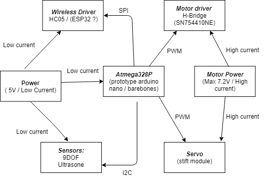
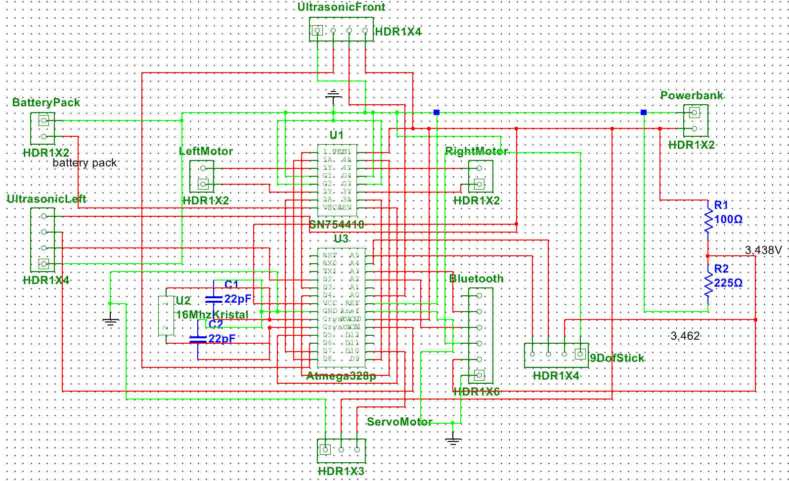
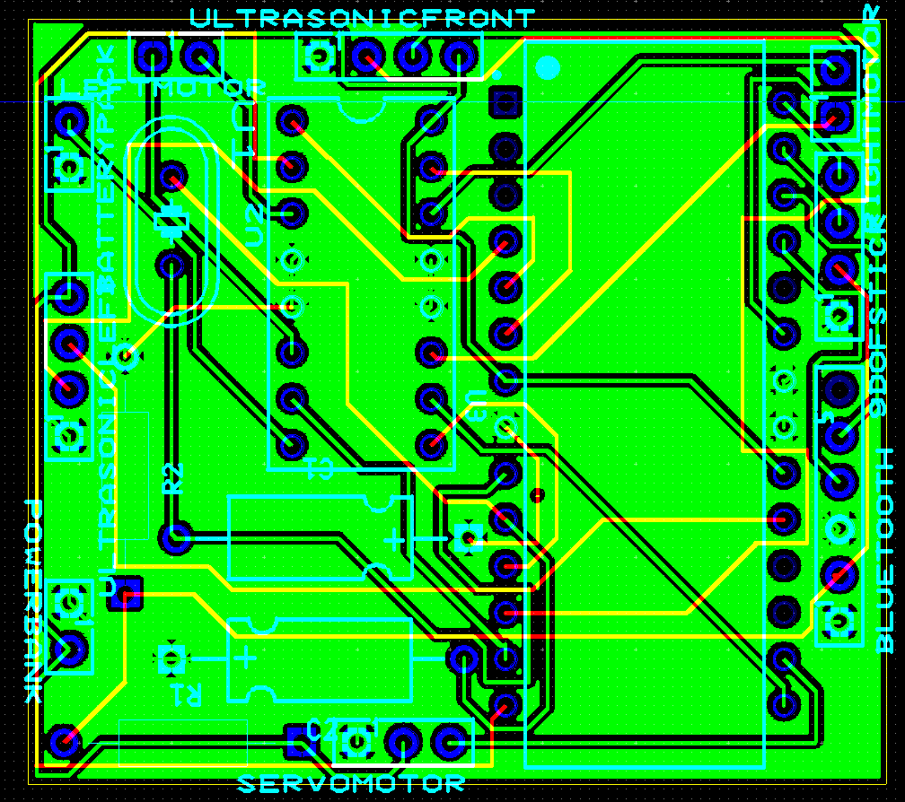

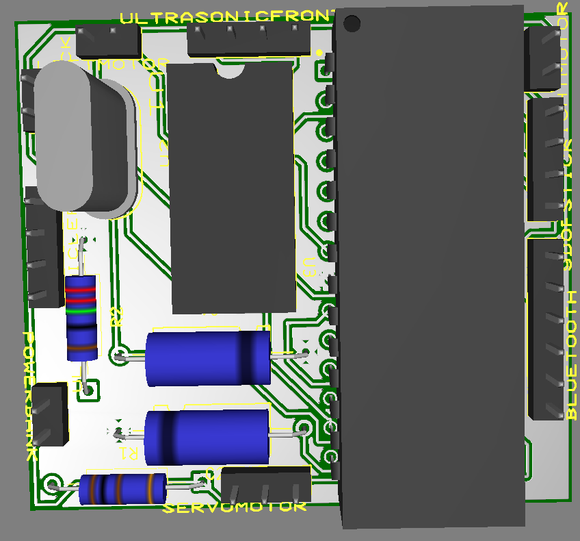

We gaan voor dit project een atmega328P Chip,16 mhz crystal en 2 22pF condensators (zelfgemaakte Arduino) om de robot mee aan te sturen gebruiken. Voor het prototype gebruiken we één Arduino Nano.
Om onze code te uploaden op de atmega328P hebben we een bootloader nodig.

De H-Bridge sn755410 is verbonden met de atmega en zorgt voor de sturing van de motoren. Door bepaalde pinnen te switchen tussen high of low op de H-bridge krijgen we beweging in onze robot.

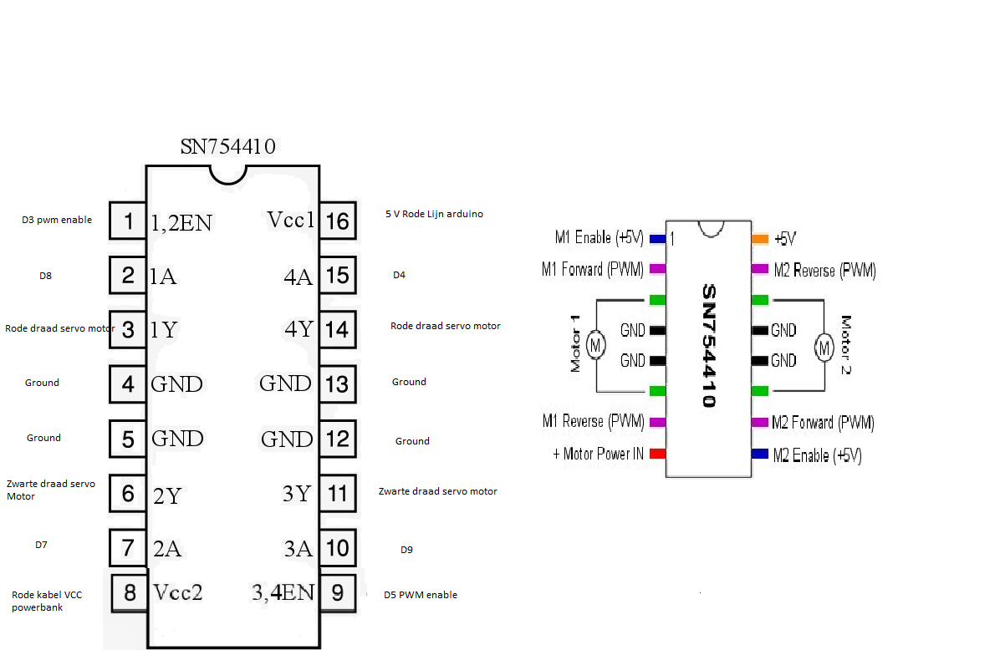

De battery pack van 9.4 V wordt aangesloten op de h-bridge voor extra vermogen voor de sturing van de motoren.
De powerbank van 5 v wordt aangesloten op de arduino (atmega328p).

De H-Bridge heeft een input die verbonden is met de atmega, de output is afkomstig van onze android applicatie.We gebruiken een HC-05 bluetooth module voor de communicatie tussen de laptop en de app en de robot en de app. Als alternatief op de Bluetooth module kunnen we gebruik maken van esp32 wifi module voor de communicatie.

We gebruiken een servomoter SG-90 om de pen vast te houden en op en neer te laten gaan.

We gebruiken een 9DOF-stick voor het bepalen van de hoek en het berekenen van de richting van de robot.

We maken gebruik van 2 ultrasone sensors (vooraan en links).
Deze sensors zullen onze richting bepalen en ervoor zorgen dat de robot niet tegen de randen van de houten kist botst.
Elke sensor berekent de afstand om op deze manier het midden te vinden (calibratie).

#### Specificaties en/of elektrische karakteristieken

Blok | Specificatie | Min | Nominaal | Max
---------|----------|---------|---------|----------|
Motor Power| Werkspanning | 7V | 7.2V | 7V
(powerbank) |Stroom |0.5A | 1A | 2A
.| Werkspanning |  | 5V | 
.| Capaciteit | | 6000mAH|
ATmega328p| Fcpu |  | 16MHz |
.| Werkspanning | 4.8V | 5V | 5.2V
LSM9DS1 9DOF stick | Werkspanning | | 3.3V |
.| Acceleratie (linear) | 2g| | 16g
.| Magnetisme | 4 gauss| | 16 gauss
.| Hoek | 245dps| | 2000 dps
HC-SR04 Ultrasonic Distance Sensor | Werkspanning | | 5V DC |
.| Hoek| | 15° |
.| Afstand | 2cm| | 4cm
HC-05 Bluetooth Module| Werkspanning | 1.8 V |  | 3.6V
ESP32 Wifi Module ?| Werkspanning | | 3.3V DC | 
.| Temperatuur | -40 °C |  | 125°c
SG90 micro-servo| Werkspanning | 4.8V| 4.8V | 6V
.| Kracht |  | 1.8kg/cm | 
SN754110NE H-Bridge Motor Driver| VI | -0.5 V | 5V | 36V
.| VCC |-0.5 V | 5V | 36V
.| Stroom | | +-1A |+-2A
.| Temperatuur | -40 °C |  | 85°c
#### Argumentatie

Blok | Argumentatie | Alternatieven 
---------|----------|---------|
Motor Power| De powerbank is oplaadbaar en levert de correcte spanning voor de sturing van de arduino. De alkaline battery pack past perfect tussen het chasis van de wielen van de robot en zorgt voor het juiste voltage voor de sturing van de motoren. De powerbank was beschikbaar en moest niet aangekocht worden, net zoals de alkaline batterypack| Alkaline Battery Pack,Powerbank
Wireless Driver| De HC-05 bluetooth module is perfect voor de verbinding tussen de android app en de arduino en de android app en de laptop/desktop. Deze zit ook in onze microcontroller kit. Een goed alternatief zou de ESP32 wifi module zijn om de verbindingen te maken| Bluetooth HC-05, Wifi ESP32
Motor Driver| Voor de sturing van de motoren is de SN754410 zeer makkelijk om mee te werken. Deze is zeer gedetailleerd beschreven en zit reeds in onze kit. Als alternatief kan je zelf een Mosfet H-bridge schakeling maken.|Mosfet-schakeling H-bridge, SN754410
Distance Sensor| Voor de positionering van de robot gebruiken we 2 HC-SR04 Ultrasonic Distance Sensors. Deze zaten reeds in onze microcontroller kit en zijn eenvouding te gebruiken. De VL53L0x is veel kleiner, maar zijn bereik is kleiner als bij de HC-SR04. |HC-SR04 Ultrasonic Distance Sensor,vl53l0x
Angle Sensor| Voor het berekenen van de hoek gebruiken we de gyroscoop van de LSM9DS1 9DOF stick Deze heeft een 3-axis accelerometer, 3-axis gyroscope, 3-axis magnetometer. Deze is zeer klein en makkelijk in gebruik en zat reeds in onze kit. Als alternatief zouden we ook een L3GD20H kunnen gebruiken. Dit is een losstaande gyroscoop en iets nauwkeuriger.|LSM9DS1 9DOF stick,L3GD20H

## Software analyse
We gaan Android Studio gebruiken om een applicatie te maken die de robot kan besturen. Men kan met behulp van de applicatie een bluetooth verbinding maken met de robot. We zullen een bluetooth plugin moeten maken met Android Studio om een verbinding te krijgen met HC-05. De robot gaat zelf kunnen bewegen, maar we hebben ook controle in de applicatie gezet zodat we de robot manueel kunnen besturen. Er is een apart scherm in de applicatie waar je de data van alle sensoren kan lezen. Je zult daar ook de positie van de robot kunnen vinden. De twee belangrijkste knoppen in de applicatie zijn "Callibration" en "Start". Met de knop Callibration zal de robot alle sensoren activeren, zo gaat die de afstand meten tussen de robot en de muren van het bakje. Als de robot die data heeft, gaat die naar zijn volgende positie. Met de knop start wordt de robot gestart.

Voor de beweging van de robot zullen we Arduino IDE gebruiken. Hiermee zullen we de broncode van de robot schrijven. Van data halen uit de sensoren tot het besturen van de robot. Nadat er een verbinding is met bluetooth stuur je de coördinaten van de GIF door naar de HC-05. Op die manier heb je de coördinaten gekregen zodat de robot kan bewegen.
(Ultrasone & 9DoF stick & Servo & Motors) 
### State diagram
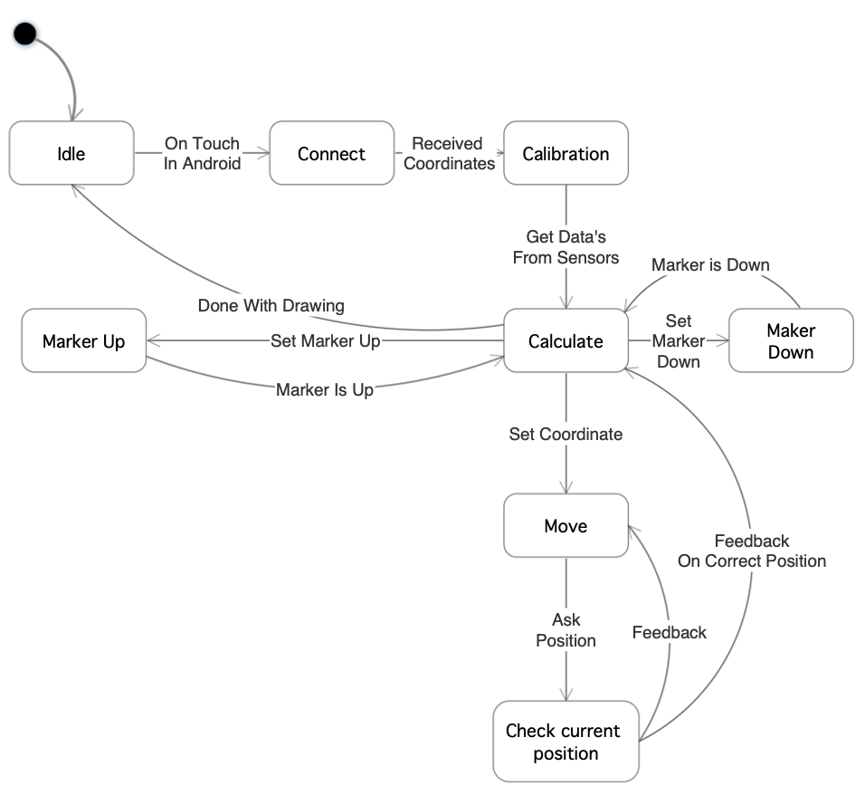

#### Flow Chart
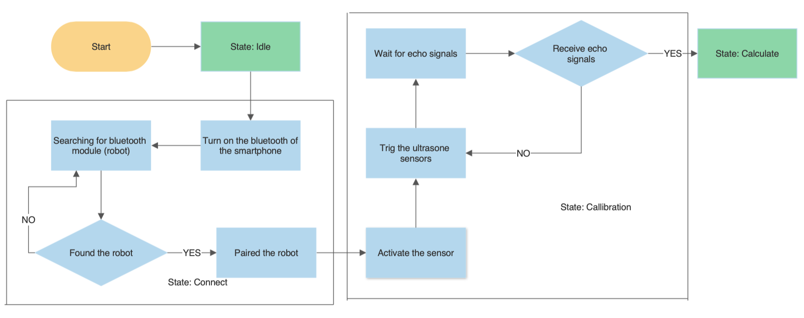
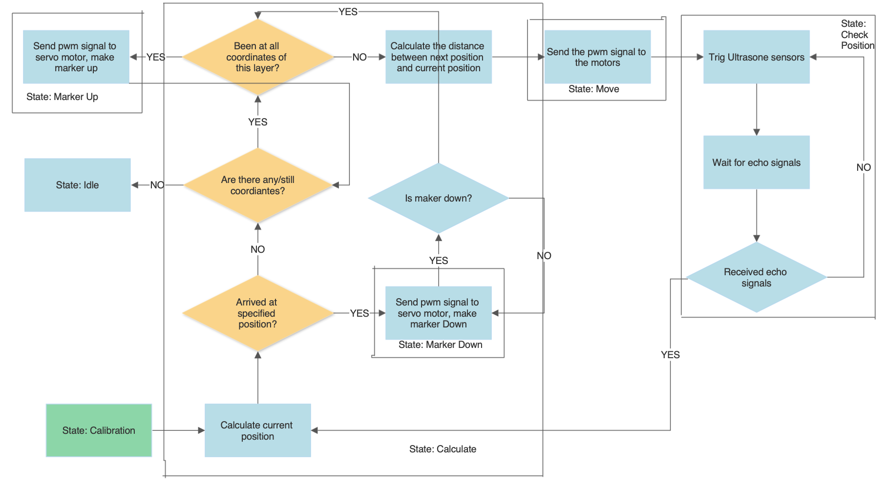
Als de robot wordt opgestart staat de robot stil en doet niets, dan zoekt de robot naar smartphone apparaten waarmee het kan verbinden langs de bluetooth module. Als de robot een smartphone apparaat heeft gevonden, worden de twee apparaten met elkaar verbonden, zo niet, gaat de robot terug zoeken naar andere apparaten. Als alles goed is verbonden worden de sensoren geactiveerd. Als eerste gaan de ultra sonic sensoren triggeren, als er een object wordt gevonden door de ultra sonic sensor, stuurt die een echo terug met de afstand tussen het object en de sensor.
Nadat de robot gekalibreert is moet de robot de berekingen gaan doen om naar de volgende positie te gaan.
Als de robot zijn huidige positie berkend heeft, gaat hij vragen of die op zijn juiste positie zit of niet. Als het juist is, wordt er een pwm singaal gestuurd naar de servo motor waardoor de pen naar beneden gaat. Als de robot zich niet op de juiste positie bevindt, gaat de robot op zoek naar een andere positie. Als er nog posities over zijn gaat de robot kijken of die naar alle posities is geweest of niet. Als die niet naar alle posities is geweest gaat de robot de afstand tussen de huidige en de volgende positie bepalen. Als de afstand bepaalt is, worden er pwm signaal doorgestuurd  naar de motoren.
Als dat allemaal gebeurt is gaan de ultra sonic sensoren terug triggeren om de afstand tussen het object en de robot te bepalen. Als de robot data binnen krijgt met de echo gaat de robot terug naar het begin van de state Calculate.

Blok | Data In | Data uit
---------|----------|---------
 ATMega328P | Configuratie instellingen, Sensordata | Configuratie instellingen, Sensordata
 Internal servomotors drivers (robot chassis) | PWM Signaal | N.V.T
 Ultrasone Sensor| Digitaal Signaal(Trigger) | Digitaal Signaal(Echo)
 Bluetooth Module| Coördinaten(JSON of Txt)| Configuratie instellingen, Sensordata
 Stift Controller| PWM signaal| N.V.T 
 Laptop/Android| Sensordata(Debug)| Configuratie instellingen
 9 DoF Stick (gyroscope) | Digitaal Signaal| Digitaal Signaal

### Mockup
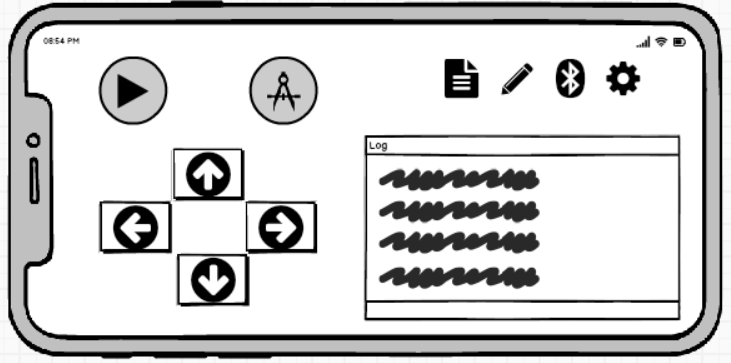

## User stories en Engineering Tasks
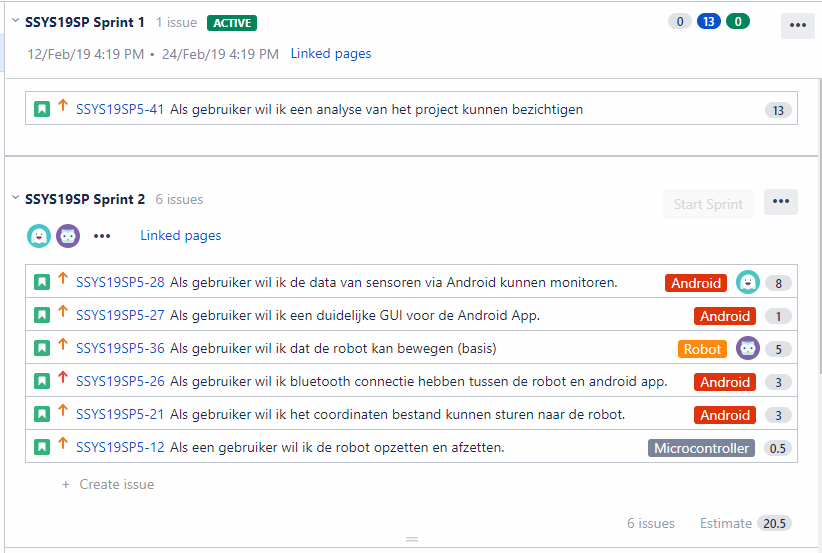
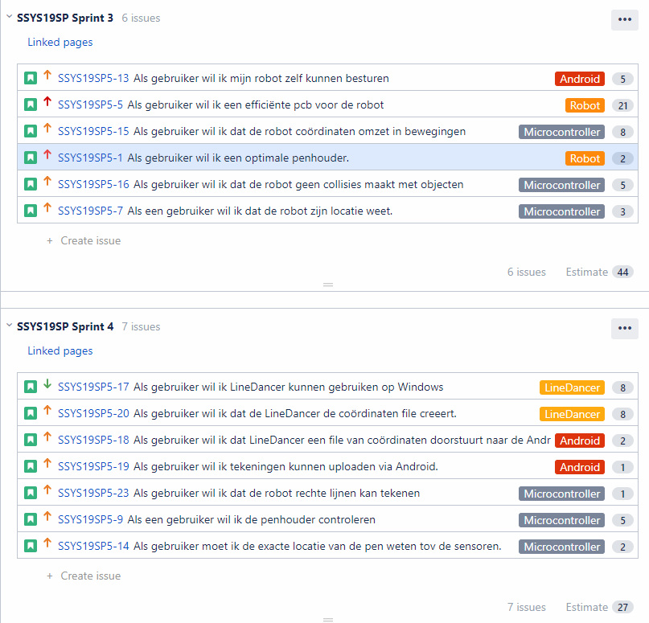
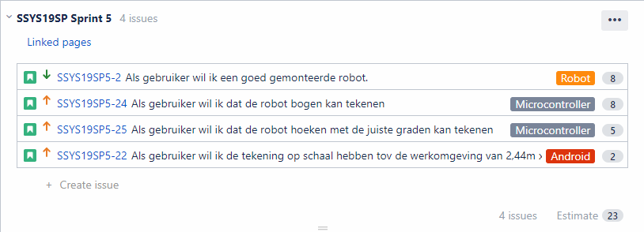

### Release plan
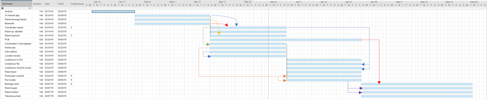

## systeemspecificaties

Robot build:
1. Powerbank (5V / low current)
2. Alkaline Battery pack (9,4V / high current)
3. Atmega328P (arduino /barebone)
4. HC05 bluetooth module
5. LSM9DS1 9DOF-Stick
6. Servo motor (SG90 Tower Power) 
7. Motor driver H-bridge (SN754410NE)
8. Motor Power ( Max 7.2V / high current) 
9. 2 HC-SR04 Ultrasonic Distance Sensor
10. Android Device
11. Windows PC

